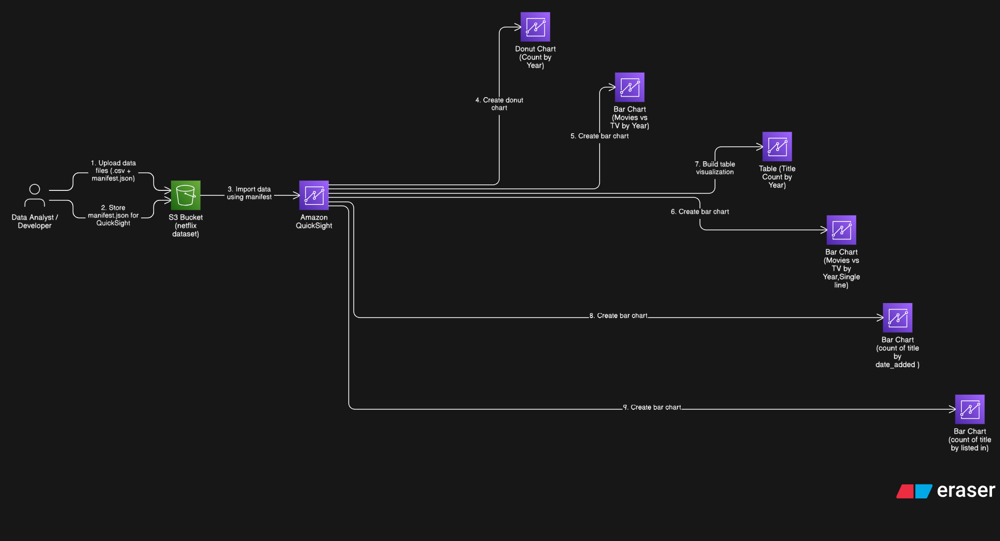
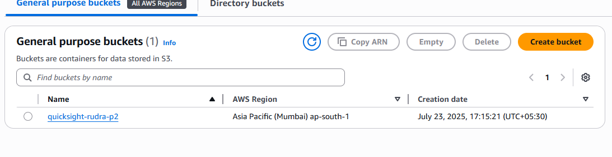
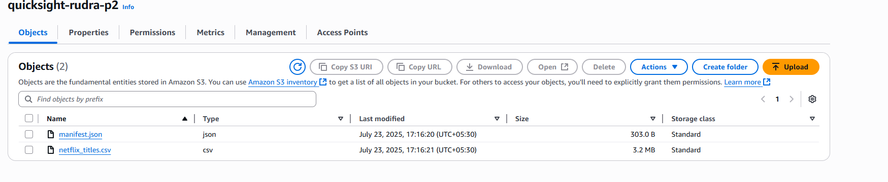
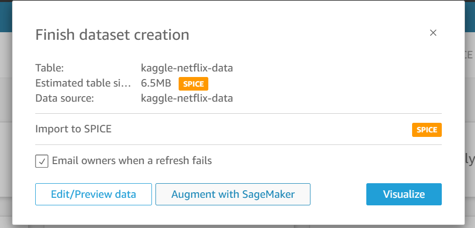
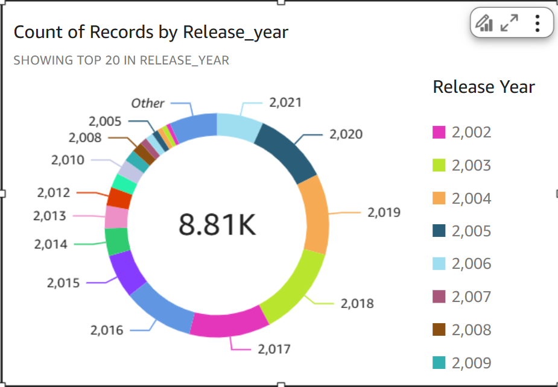
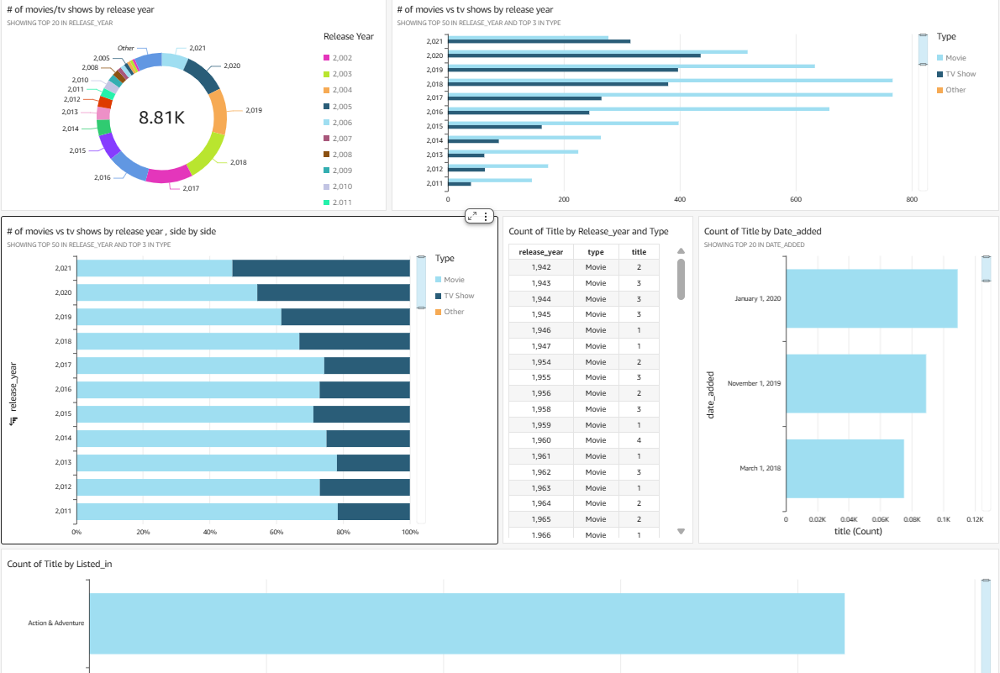

# AWS Netflix Data Analytics with QuickSight

---

## 📌 Project Overview
This project showcases how to connect Netflix dataset stored in S3 with Amazon QuickSight and create interactive visualizations.

### Key Highlights
- Uploaded `netflix_titles.csv` and `manifest.json` into S3  
- Configured QuickSight to ingest S3 data  
- Created visualizations:
  - Donut chart showing count of titles by release year  
  - Bar chart comparing movies vs TV shows over time  
  - Tabular view of title counts per year  

---

## 🎯 Why These AWS Services?

### Amazon S3
- **Why S3?** Secure and scalable storage for raw datasets  
- **Competitor alternative?** Unlike local files or databases, S3 offers high durability and ease of integration with QuickSight  

### Manifest File
- **Why manifest.json?** Specifies file URIs and format so QuickSight can correctly parse the dataset  
- **Why not direct upload?** QuickSight requires a manifest file for S3 ingestion  

### Amazon QuickSight
- **Why QuickSight?** Cloud-native BI tool—zero infrastructure, interactive charts in minutes  
- **Competitor alternative?** Compared to external BI tools (e.g., Tableau), QuickSight is fully managed and cost-effective within AWS  

---

## 🔧 Tech Stack

| Service             | Purpose                                       |
|---------------------|-----------------------------------------------|
| Amazon S3           | Host Netflix CSV & manifest.json               |
| manifest.json       | Guide QuickSight on locating data            |
| Amazon QuickSight   | Visualize data—charts and dashboards         |
| AWS Console Skills  | Uploading, configuring, connecting, designing|

---

## 🏗 Architecture

[View Eraser.io Code](architecture/architecture.txt)

---

## 📸 Screenshots

### 1. S3 Bucket Creation and Upload

### 2. file upload in s3

### 3. QuickSight Data Source Setup

### 3. Donut Chart – Titles by Release Year

### 4. Final Dashboard View

---

## 🚀 How to Reproduce

1. Create an S3 bucket and upload `netflix_titles.csv` & `manifest.json`.  
2. In QuickSight, grant S3 access and add dataset via manifest.  
3. Import into SPICE and select tables.  
4. Build visualizations: donut, bar chart, table.  
5. Save analysis and optionally export dashboard.

---

## 🎓 Key Learning Outcomes

- Managed S3 and ingestion manifest for datasets  
- Learned how to configure QuickSight data sources and services  
- Built functional dashboards to visualize real-world data  
- Understood chart types and narrative data storytelling  

---

### 💡 Next Improvements
- Automate dataset ingestion via AWS CLI or Terraform  
- Add alternative visualizations: time series, filters  
- Secure dashboards with user permissions and scheduling

---

## 📝 LICENSE
MIT License – see LICENSE file for details
=======
# AWS Netflix Data Analytics with QuickSight

---

## 📌 Project Overview
This project showcases how to connect Netflix dataset stored in S3 with Amazon QuickSight and create interactive visualizations.

### Key Highlights
- Uploaded `netflix_titles.csv` and `manifest.json` into S3  
- Configured QuickSight to ingest S3 data  
- Created visualizations:
  - Donut chart showing count of titles by release year  
  - Bar chart comparing movies vs TV shows over time  
  - Tabular view of title counts per year  

---

## 🎯 Why These AWS Services?

### Amazon S3
- **Why S3?** Secure and scalable storage for raw datasets  
- **Competitor alternative?** Unlike local files or databases, S3 offers high durability and ease of integration with QuickSight  

### Manifest File
- **Why manifest.json?** Specifies file URIs and format so QuickSight can correctly parse the dataset  
- **Why not direct upload?** QuickSight requires a manifest file for S3 ingestion  

### Amazon QuickSight
- **Why QuickSight?** Cloud-native BI tool—zero infrastructure, interactive charts in minutes  
- **Competitor alternative?** Compared to external BI tools (e.g., Tableau), QuickSight is fully managed and cost-effective within AWS  

---

## 🔧 Tech Stack

| Service             | Purpose                                       |
|---------------------|-----------------------------------------------|
| Amazon S3           | Host Netflix CSV & manifest.json               |
| manifest.json       | Guide QuickSight on locating data            |
| Amazon QuickSight   | Visualize data—charts and dashboards         |
| AWS Console Skills  | Uploading, configuring, connecting, designing|

---

## 🏗 Architecture

[View Eraser.io Code](architecture/architecture.txt)

---

## 📸 Screenshots

### 1. S3 Bucket Creation and Upload

### 2. file upload in s3

### 3. QuickSight Data Source Setup

### 3. Donut Chart – Titles by Release Year

### 4. Final Dashboard View

---

## 🚀 How to Reproduce

1. Create an S3 bucket and upload `netflix_titles.csv` & `manifest.json`.  
2. In QuickSight, grant S3 access and add dataset via manifest.  
3. Import into SPICE and select tables.  
4. Build visualizations: donut, bar chart, table.  
5. Save analysis and optionally export dashboard.

---

## 🎓 Key Learning Outcomes

- Managed S3 and ingestion manifest for datasets  
- Learned how to configure QuickSight data sources and services  
- Built functional dashboards to visualize real-world data  
- Understood chart types and narrative data storytelling  

---

### 💡 Next Improvements
- Automate dataset ingestion via AWS CLI or Terraform  
- Add alternative visualizations: time series, filters  
- Secure dashboards with user permissions and scheduling

---

## 📝 LICENSE
MIT License – see LICENSE file for details
>>>>>>> 89dae73fa72b13a5b9dc1270464796b9cf66b376
